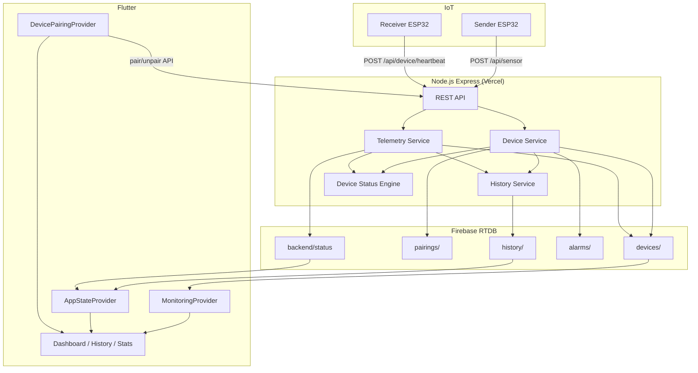
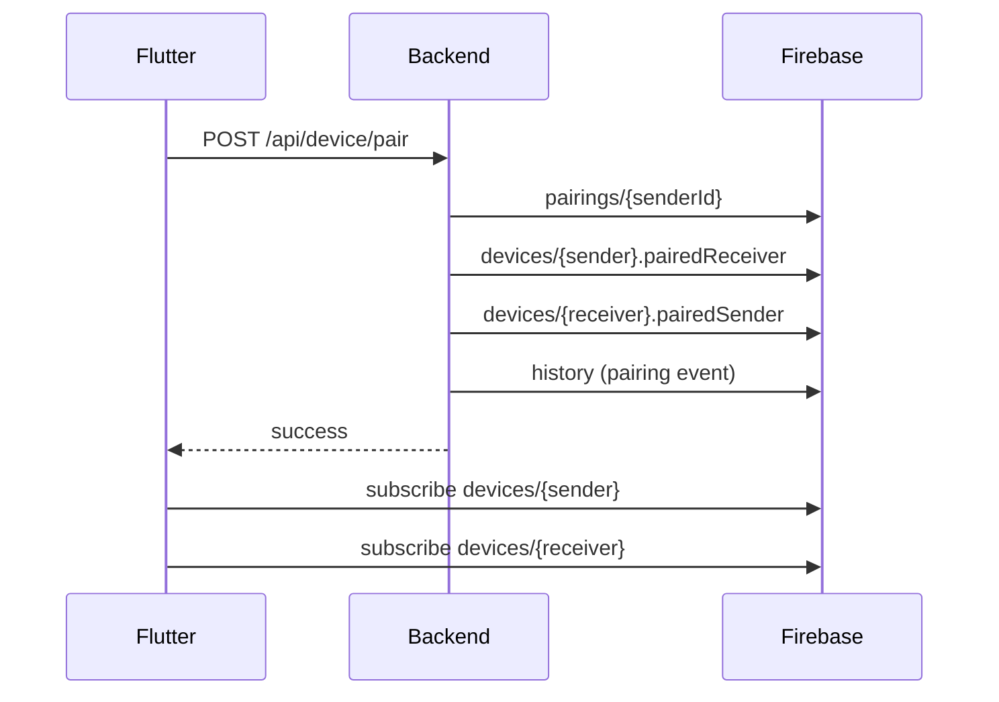

# TrackSafe Link — System Documentation

## 1. Executive Summary

TrackSafe Link is a railway worker safety IoT system connecting ESP32/LilyGO devices, a Node.js backend, Firebase Realtime Database, and a Flutter monitoring app. This release completes backend-managed pairing, receiver heartbeat support, centralized history recording, and Flutter screens wired to Firebase streams.

## 2. Root Cause Analysis

| Problem | Root Cause | Fix |
|---------|-----------|-----|
| Receiver missing in Firebase | No receiver registration/heartbeat path | `POST /api/device/register` + `simulate-receiver.js` |
| Pairing local-only | Flutter wrote SharedPreferences without backend unpair/sync | `BackendApiService` + backend `pairings/` as source of truth |
| History incomplete | `HistoryScreen` returned empty widget when data existed | Full ListView with event types |
| Dashboard partial updates | Receiver used `timestamp` only; heartbeat wrote `lastUpdate` | `effectiveTimeMs` in `MonitoringModel` + offline detector fix |
| Backend incomplete endpoints | Already present in routes; history/alarm not centralized | `history.service.js` + telemetry enhancements |

## 3. Architecture Diagram



## 4. Firebase Structure

```
/
├── devices/
│   ├── sender01/
│   │   ├── deviceId, deviceType, status, battery, signal, gsmSignal
│   │   ├── network, firmware, latitude, longitude, speed, distance
│   │   ├── pairedReceiver, pairedAt, lastSeen, lastUpdate, online
│   │   ├── alarm, connectionStatus, linkStatus, gpsFix
│   └── receiver01/  (same schema)
├── pairings/
│   ├── sender01/   { receiverId, pairedAt }
│   └── receiver01/ { senderId, pairedAt }
├── history/        { eventType, deviceId, status, timestamp, ... }
├── alarms/         { deviceId, status, acknowledged, timestamp }
├── backend/
│   ├── status/     { online, timestamp }
│   └── health/     { timestamp }
├── notifications/  (reserved)
├── connection/     (reserved)
└── telemetry/      (reserved)
```

## 5. API Documentation

| Method | Endpoint | Description |
|--------|----------|-------------|
| POST | `/api/device/register` | Register sender or receiver |
| POST | `/api/device/heartbeat` | Universal heartbeat (sender/receiver) |
| POST | `/api/device/pair` | Backend-managed pairing |
| POST | `/api/device/unpair` | Remove pairing |
| POST | `/api/device/location` | Update GPS |
| POST | `/api/device/status` | Update status/alarm |
| POST | `/api/sensor` | Sender telemetry (ESP32) |
| GET | `/api/device/:id` | Device detail |
| GET | `/api/device/pairing/:id` | Pairing info |
| GET | `/api/device/list` | List all devices |
| GET | `/api/history` | History entries |
| GET | `/api/backend/status` | Backend health |
| GET | `/api/status` | Legacy health + Firebase ping |

## 6. Flutter Data Flow

```
DevicePairingProvider → BackendApiService (pair/unpair)
                     → FirebaseService.deviceStream(receiver)
MonitoringProvider   → MonitoringRepository → FirebaseService.monitoringStream(sender)
AppStateProvider     → FirebaseService.historyStream()
                     → BackendStatusService (GET /api/status)
Dashboard            → Consumer4(Monitoring, AppState, Settings, Pairing)
HistoryScreen        → AppStateProvider.history (Firebase stream)
```

## 7. Backend Data Flow

```
ESP32 sensor → telemetry.service → devices/{id} + history (on events)
Heartbeat    → device.service    → devices/{id} + linkStatus
Pair         → device.service    → pairings/ + devices/ + history
Alarm        → device.service    → alarms/ + history
```

## 8. ESP32 Data Flow

**Sender:** `POST /api/sensor` every 5s with GPS, distance, battery, signal, status.

**Receiver:** `POST /api/device/register` once, then `POST /api/device/heartbeat` every 5s.

## 9. Sequence Diagram — Pairing



## 10. State Diagram — Device Link

```
OFF → WAITING → CONNECTING → ONLINE
 ↑___________________________|  (heartbeat timeout > 30s)
```

## 11. Local Development

```bash
# Terminal 1
cd backend && npm install && npm run dev

# Terminal 2 — register devices + pair
npm run simulate:devices

# Terminal 3 — sender telemetry
npm run simulate:gps

# Terminal 4 — receiver heartbeat
npm run simulate:receiver

# Flutter
cd flutter_app
flutter pub get
flutter run --dart-define=BACKEND_BASE_URL=http://10.0.2.2:3000
```

## 12. Validation Commands

```bash
cd backend && npm test
cd flutter_app && flutter analyze && flutter test
```
